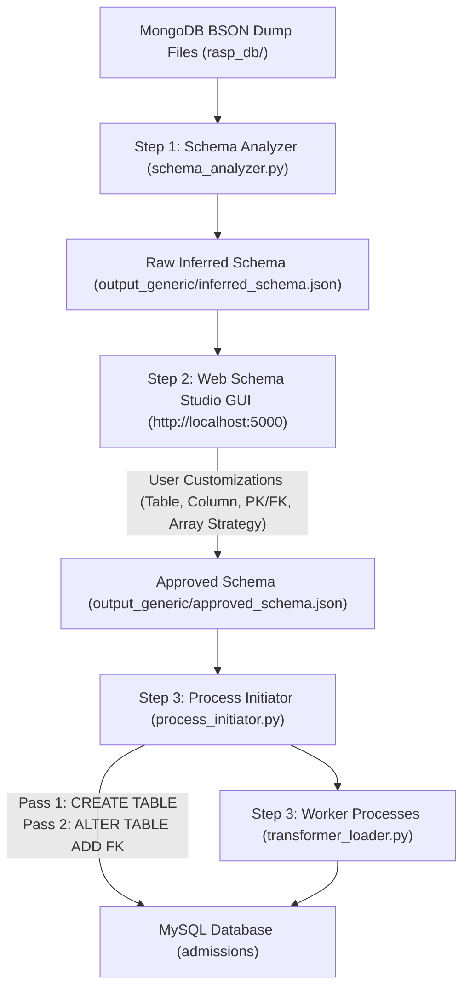

# Implementation Plan: MongoDB to MySQL Migration via `etl_generic`

This plan details the implementation of an automatic, dynamic schema mapping ETL pipeline based on the methodology described in *Aftab et al. (2020) - Automatic NoSQL to Relational Database Transformation with Dynamic Schema Mapping*, extended with an interactive **Web Schema Studio GUI** for mid-pipeline user schema customization.

The pipeline is contained within `etl_generic/` and transforms MongoDB BSON dump files (from `rasp_db/`) into relational MySQL tables, fully dockerized.

---

## Pipeline Architecture & Methodology

The pipeline follows a 3-stage process combining automated inference, interactive user overrides, and concurrent ETL loading:



### Core Algorithms & Extensions
1. **Algorithm 1 (Schema Analyzer)**: Scans BSON records to dynamically infer table structures, data types (handling type widening), primary keys (`_id`), array strategies, and child tables for nested documents and arrays up to depth $k=2$.
2. **Mid-Pipeline Layer (Web Schema Studio GUI)**: Flask-based web interface blocking execution post-inference, allowing users to visually inspect and customize the schema across 4 operational categories before MySQL creation.
3. **Algorithm 2 (Processes Initiation & DDL Engine)**: Executes a 2-pass DDL initialization ONCE globally across all approved tables (Pass 1: Table Creation; Pass 2: FK Constraint creation via `ALTER TABLE`), partitions document ranges, and spawns concurrent worker processes.
4. **Algorithm 3 (Transformation & Loading)**: Multi-process worker engine reading BSON document batches, creating relational rows for parent/child tables, executing bulk inserts into MySQL, and handling deadlock retries.

---

## 4 Categories of Supported User Schema Modifications

Users can customize the inferred schema in the Web GUI prior to migration:

1. **Table-Level Modifications**:
   - **Rename Table**: Modify target MySQL table names for root collections and child tables.
   - **Exclude / Include Table**: Toggle entire tables on/off. Excluded tables are omitted from DDL table creation and data ingestion.
2. **Column-Level Modifications**:
   - **Rename Column**: Custom column name mapping from BSON keys to target MySQL columns.
   - **Alter Data Type**: Override detected types (`VARCHAR(64)`, `VARCHAR(255)`, `TEXT`, `LONGTEXT`, `INT`, `BIGINT`, `DOUBLE`, `DECIMAL(38,10)`, `DATETIME(6)`, `BOOLEAN / TINYINT(1)`, `JSON`).
   - **Toggle Nullability**: Switch columns between `NULL` and `NOT NULL`.
   - **Exclude / Include Column**: Omit specific columns from DDL generation and data insertion.
3. **Keys & Constraints Modifications**:
   - **Primary Key (PK) Selection**: Radio button selection to set/change the Primary Key column per table.
   - **Foreign Key (FK) Constraints Studio**:
     - **Add FK**: Create new relational links between any two tables (root or child).
     - **Alter FK**: Modify Local FK Column, Target Parent Table, Target Referenced Column, and `ON DELETE` rules (`CASCADE`, `SET NULL`, `RESTRICT`, `NO ACTION`).
     - **Remove FK**: Delete unwanted or inferred FK constraints.
4. **Array / Object Normalization Strategy**:
   - **1NF Child Table Normalization**: Split nested arrays/documents into separate relational child tables linked by FK.
   - **Inline JSON Column**: Preserve arrays as native MySQL `JSON` columns directly inside the parent table.

---

## Package Components (`etl_generic/`)

#### [bson_reader.py](file:///home/jinesh14/CourseWork/Sem9/Sarvesh_Code/etl_generic/bson_reader.py)
- Streams and counts BSON documents from BSON dump files.
- Provides indexed/offset reading (`start`, `limit`) for process partitioning.
- Normalizes BSON-specific types (`ObjectId`, `datetime`, `Decimal128`, `bytes`).

#### [schema_analyzer.py](file:///home/jinesh14/CourseWork/Sem9/Sarvesh_Code/etl_generic/schema_analyzer.py) (**Algorithm 1**)
- Recursively inspects documents and key-value pairs up to depth $k=2$.
- Performs type widening across heterogeneous document values.
- Populates explicit `fk_constraints` objects for child tables and arrays.

#### [web_gui.py](file:///home/jinesh14/CourseWork/Sem9/Sarvesh_Code/etl_generic/web_gui.py) & [templates/index.html](file:///home/jinesh14/CourseWork/Sem9/Sarvesh_Code/etl_generic/templates/index.html)
- Serves Web Schema Studio on port 5000 (`http://localhost:5000`).
- Provides REST endpoints `/api/schema` and `/api/approve-schema`.
- Blocks pipeline execution until user approval.
- Saves approved schema modifications into `output_generic/approved_schema.json` and updates all per-collection schema JSON files in `output_generic/`.

#### [process_initiator.py](file:///home/jinesh14/CourseWork/Sem9/Sarvesh_Code/etl_generic/process_initiator.py) (**Algorithm 2**)
- Executes global 2-pass DDL initialization in MySQL:
  - **Pass 1**: `CREATE TABLE IF NOT EXISTS` for all non-excluded tables (`VARCHAR(64)` enforced on FK columns for index compatibility).
  - **Pass 2**: `ALTER TABLE ADD CONSTRAINT` for all user-approved and inferred Foreign Keys.
- Disables `FOREIGN_KEY_CHECKS=0` during DDL resets.
- Divides document ranges into $n$ logical partitions (`start`, `limit`) and spawns worker processes via Python `multiprocessing`.

#### [transformer_loader.py](file:///home/jinesh14/CourseWork/Sem9/Sarvesh_Code/etl_generic/transformer_loader.py) (**Algorithm 3**)
- Reads document batches for assigned partitions.
- Generates parent and child table insert rows (`create_query_data`), respecting column/table renames and exclusions.
- Executes batch inserts (`INSERT IGNORE INTO ...`) with transaction management and deadlock retries (MySQL error 1213).

#### [cli.py](file:///home/jinesh14/CourseWork/Sem9/Sarvesh_Code/etl_generic/cli.py) & [run_generic_etl.py](file:///home/jinesh14/CourseWork/Sem9/Sarvesh_Code/run_generic_etl.py)
- CLI entrypoint accepting `--dump-dir`, `--db-uri`, `--gui-port`, `--headless`, `--workers`, `--batch-size`, `--recreate-schema`.
- Orchestrates Step 1 Inference $\rightarrow$ Step 2 Web GUI Review $\rightarrow$ Step 3 DDL & Batch Load.

---

## Commands to Start Migration

### 1. Interactive Web GUI Mode (Default & Recommended)
To run the full pipeline with the interactive Web Schema Studio GUI exposed on port `5000`:

```bash
# 1. Start MySQL database container
docker compose up -d mysql

# 2. Run ETL container in interactive mode with port 5000 mapped
docker compose run --rm -p 5000:5000 etl
```

- Open **`http://localhost:5000`** in your browser.
- Inspect and customize table/column names, data types, PK/FK constraints, or array strategies.
- Click **"Approve & Execute Migration"** to trigger DDL creation and data loading.

### 2. Headless Non-Interactive Mode
To run the migration automatically without launching the Web GUI:

```bash
docker compose run --rm etl python3 run_generic_etl.py --headless
```

---

## Verification Plan

### Verification Commands
1. Check created tables and row counts in MySQL:
   ```bash
   docker exec admissions-mysql mysql -u admissions -padmissions admissions -e "SHOW TABLES; SELECT COUNT(*) FROM rounds; SELECT COUNT(*) FROM applications; SELECT COUNT(*) FROM applications_offered_payment_refNo_list; SELECT COUNT(*) FROM users;"
   ```
2. Verify Foreign Key constraints in MySQL DDL:
   ```bash
   docker exec admissions-mysql mysql -u root -prootpass admissions -e "SHOW CREATE TABLE rounds; SHOW CREATE TABLE applications_offered_payment_refNo_list;"
   ```
3. Inspect saved output JSON schema files:
   ```bash
   cat output_generic/approved_schema.json
   cat output_generic/rounds.json
   ```
