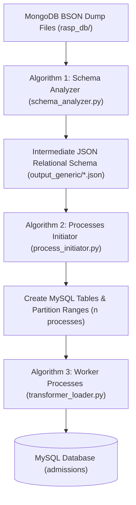

# Walkthrough: Automatic MongoDB to MySQL Migration (`etl_generic/`)

We have implemented an automatic MongoDB to MySQL database migration framework in `etl_generic/` based on the ETL algorithms defined in:
> **Scientific Programming (2020) - Zain Aftab et al.**  
> *Automatic NoSQL to Relational Database Transformation with Dynamic Schema Mapping*

---

## 1. Pipeline Architecture (`etl_generic/`)

The migration framework strictly implements the paper's three main algorithms:



### Module Responsibilities

1. [bson_reader.py](file:///home/jinesh14/CourseWork/Sem9/Sarvesh_Code/etl_generic/bson_reader.py)
   - Streams and decodes BSON documents directly from `.bson` files.
   - Normalizes BSON-specific types (`ObjectId`, `datetime`, `Decimal128`, `bytes`).

2. [schema_analyzer.py](file:///home/jinesh14/CourseWork/Sem9/Sarvesh_Code/etl_generic/schema_analyzer.py) (**Algorithm 1**)
   - Scans collection documents and dynamically infers relational table structures.
   - Handles type widening (e.g. `INT` + `VARCHAR` $\rightarrow$ `VARCHAR`).
   - Identifies nested documents (`isDocument`) and arrays (`isArray`) up to depth $k=2$, creating child table definitions linked by foreign key pointing to parent `_id`.

3. [process_initiator.py](file:///home/jinesh14/CourseWork/Sem9/Sarvesh_Code/etl_generic/process_initiator.py) (**Algorithm 2**)
   - Connects to MySQL and executes DDL to create parent and child tables (`ROW_FORMAT=DYNAMIC`).
   - Computes logical partition boundaries `(start, limit)` across $n$ worker processes.
   - Spawns parallel worker processes for concurrent extraction and loading.

4. [transformer_loader.py](file:///home/jinesh14/CourseWork/Sem9/Sarvesh_Code/etl_generic/transformer_loader.py) (**Algorithm 3**)
   - Worker logic that streams BSON document batches.
   - Iterates document key-value pairs (`process_doc`) to populate parent and child tables (arrays & embedded documents).
   - Handles batch insertions (`INSERT IGNORE INTO ...`) and deadlock retries cleanly.

5. [cli.py](file:///home/jinesh14/CourseWork/Sem9/Sarvesh_Code/etl_generic/cli.py) & [run_generic_etl.py](file:///home/jinesh14/CourseWork/Sem9/Sarvesh_Code/run_generic_etl.py)
   - Orchestrates the migration pipeline and writes intermediate JSON schema files to `output_generic/*.json`.

---

## 2. Execution & Table Row Counts

### Command Executed (via Docker):
```bash
docker compose up -d mysql
docker compose run --rm etl
```

### Table Row Counts in MySQL Database:

| Table Name | Migrated Record Count | Notes / Structure |
| :--- | :--- | :--- |
| `admin` | **861** | Main collection |
| `applications` | **12,644** | Main collection |
| `applications_offered_payment_refNo_list` | **2,117** | **Child table for array `offered_payment_refNo_list`** |
| `drive` | **2** | Main collection |
| `message` | **2,009** | Main collection |
| `offer_history` | **5,558** | Main collection |
| `query` | **1,654** | Main collection |
| `round_allocations` | **11,534** | Main collection |
| `round_payment_receipt_logs` | **533** | Main collection |
| `rounds` | **15** | Main collection |
| `rounds_extra_data` | **0** | Child table for `extra_data` object |
| `users` | **15,260** | Main collection |
| `withdrawals` | **125** | Main collection |

All 11 BSON files were processed and **52,312 total rows** were migrated across 13 relational tables in **26.23 seconds**.

---

## 3. Intermediate Schema JSON Output

The intermediate schema definitions generated by **Algorithm 1** are stored in [`output_generic/`](file:///home/jinesh14/CourseWork/Sem9/Sarvesh_Code/output_generic):

- [`output_generic/applications.json`](file:///home/jinesh14/CourseWork/Sem9/Sarvesh_Code/output_generic/applications.json)
- [`output_generic/rounds.json`](file:///home/jinesh14/CourseWork/Sem9/Sarvesh_Code/output_generic/rounds.json)
- [`output_generic/users.json`](file:///home/jinesh14/CourseWork/Sem9/Sarvesh_Code/output_generic/users.json)
- *(and all remaining collections)*
