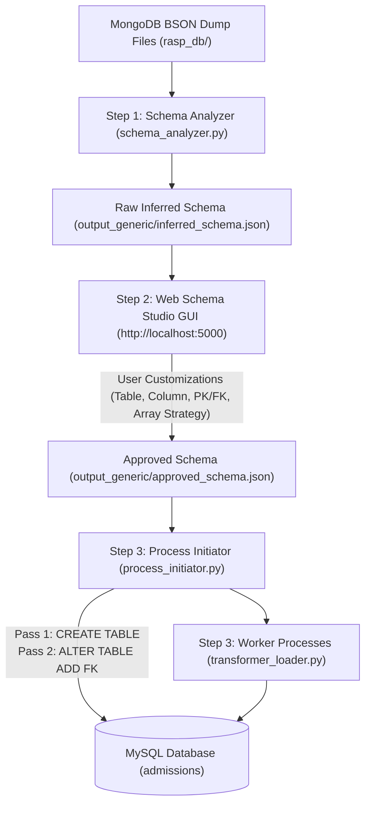

# Walkthrough: Automatic MongoDB to MySQL Migration (`etl_generic/`)

We have implemented an automatic MongoDB to MySQL database migration framework in `etl_generic/` based on the ETL algorithms defined in:
> **Scientific Programming (2020) - Zain Aftab et al.**  
> *Automatic NoSQL to Relational Database Transformation with Dynamic Schema Mapping*

The implementation extends the paper's core algorithms with an interactive **Web Schema Studio GUI** allowing real-time mid-pipeline schema modifications across 4 core operational categories.

---

## 1. Pipeline Architecture (`etl_generic/`)

The migration framework combines automated inference, user-defined schema overrides, and concurrent ETL loading:



### Module Responsibilities

1. [bson_reader.py](file:///home/jinesh14/CourseWork/Sem9/Sarvesh_Code/etl_generic/bson_reader.py)
   - Streams and decodes BSON documents directly from `.bson` files.
   - Normalizes BSON-specific types (`ObjectId`, `datetime`, `Decimal128`, `bytes`).

2. [schema_analyzer.py](file:///home/jinesh14/CourseWork/Sem9/Sarvesh_Code/etl_generic/schema_analyzer.py) (**Algorithm 1**)
   - Scans collection documents and dynamically infers relational table structures.
   - Handles type widening (e.g. `INT` + `VARCHAR` $\rightarrow$ `VARCHAR`).
   - Identifies nested documents (`isDocument`) and arrays (`isArray`) up to depth $k=2$, populating explicit `fk_constraints` objects.

3. [web_gui.py](file:///home/jinesh14/CourseWork/Sem9/Sarvesh_Code/etl_generic/web_gui.py) & [templates/index.html](file:///home/jinesh14/CourseWork/Sem9/Sarvesh_Code/etl_generic/templates/index.html) (**Mid-Pipeline Web Studio**)
   - Serves an interactive Web Studio on port 5000 (`http://localhost:5000`).
   - Blocks execution post-inference, enabling interactive user schema overrides.
   - Saves approved schema into `output_generic/approved_schema.json` and updates all per-collection schema JSON files in `output_generic/`.

4. [process_initiator.py](file:///home/jinesh14/CourseWork/Sem9/Sarvesh_Code/etl_generic/process_initiator.py) (**Algorithm 2 & DDL Engine**)
   - Connects to MySQL and executes a global 2-pass DDL initialization:
     - **Pass 1**: `CREATE TABLE IF NOT EXISTS` for all tables (`VARCHAR(64)` enforced on FK columns for index compatibility).
     - **Pass 2**: `ALTER TABLE ADD CONSTRAINT` for all active Foreign Key relationships.
   - Computes logical partition boundaries `(start, limit)` across $n$ worker processes.
   - Spawns parallel worker processes for concurrent extraction and loading.

5. [transformer_loader.py](file:///home/jinesh14/CourseWork/Sem9/Sarvesh_Code/etl_generic/transformer_loader.py) (**Algorithm 3**)
   - Worker logic streaming BSON document batches.
   - Iterates document key-value pairs (`process_doc`) to populate parent and child tables, respecting user column/table renames and exclusions.
   - Handles batch insertions (`INSERT IGNORE INTO ...`) with transaction management and deadlock retries (MySQL error 1213).

6. [cli.py](file:///home/jinesh14/CourseWork/Sem9/Sarvesh_Code/etl_generic/cli.py) & [run_generic_etl.py](file:///home/jinesh14/CourseWork/Sem9/Sarvesh_Code/run_generic_etl.py)
   - CLI orchestrator linking Step 1 Inference $\rightarrow$ Step 2 Web GUI Review $\rightarrow$ Step 3 DDL & Batch Load.

---

## 2. Supported User Schema Modifications (4 Categories)

The Web Schema Studio GUI supports interactive customization across 4 core operational categories:

1. **Table-Level Modifications**:
   - **Rename Table**: Customize MySQL table names.
   - **Exclude / Include Table**: Skip entire tables during DDL creation and data loading.
2. **Column-Level Modifications**:
   - **Rename Column**: Map original BSON keys to custom MySQL column names.
   - **Alter Data Type**: Override detected types (`VARCHAR`, `TEXT`, `LONGTEXT`, `INT`, `BIGINT`, `DOUBLE`, `DECIMAL`, `DATETIME`, `BOOLEAN`, `JSON`).
   - **Toggle Nullability**: Switch columns between `NULL` and `NOT NULL`.
   - **Exclude / Include Column**: Omit specific fields from target tables.
3. **Keys & Constraints Modifications**:
   - **Primary Key (PK) Selection**: Select/change Primary Key column per table.
   - **Foreign Key (FK) Studio**: Add new FKs, alter existing FKs (Local FK Column, Target Table, Target Ref Column, `ON DELETE` rules: `CASCADE`, `SET NULL`, `RESTRICT`, `NO ACTION`), or remove FKs.
4. **Array / Object Normalization Strategy**:
   - **1NF Child Table Normalization**: Split nested arrays into relational child tables linked by FK.
   - **Inline JSON Column**: Preserve arrays as inline `JSON` columns in the parent table.

---

## 3. How to Run the Migration

### Interactive Web GUI Mode (Recommended)
Runs the full pipeline with the interactive Web Schema Studio GUI exposed on port `5000`:

```bash
# 1. Start MySQL database container
docker compose up -d mysql

# 2. Run ETL container with port 5000 mapped
docker compose run --rm -p 5000:5000 etl
```

- Open **`http://localhost:5000`** in your browser.
- Inspect and customize table/column names, data types, PK/FK constraints, or array strategies.
- Click **"Approve & Execute Migration"** to trigger DDL creation and data loading.

### Headless Non-Interactive Mode
Runs automated migration without launching the Web GUI:

```bash
docker compose run --rm etl python3 run_generic_etl.py --headless
```

---

## 4. Execution & Table Row Counts

### Table Row Counts in MySQL Database:

| Table Name | Migrated Record Count | Notes / Structure |
| :--- | :--- | :--- |
| `admin` | **861** | Main collection |
| `applications` | **12,644** | Main collection |
| `applications_offered_payment_refNo_list` | **2,117** | **Child table for array `offered_payment_refNo_list`** |
| `drive` | **2** | Main collection |
| `message` | **2,009** | Main collection |
| `offer_history` | **5,558** | Main collection |
| `query` | **1,654** | Main collection |
| `round_allocations` | **11,534** | Main collection |
| `round_payment_receipt_logs` | **533** | Main collection |
| `rounds` | **15** | Main collection |
| `rounds_extra_data` | **0** | Child table for `extra_data` object |
| `users` | **15,260** | Main collection |
| `withdrawals` | **125** | Main collection |

All 11 BSON files are processed and **52,312 total rows** are migrated across 13 relational tables in **~20-25 seconds**.

---

## 5. Output Schema JSON Artifacts

Approved and intermediate schema JSON files are stored in [`output_generic/`](file:///home/jinesh14/CourseWork/Sem9/Sarvesh_Code/output_generic):

- [`output_generic/approved_schema.json`](file:///home/jinesh14/CourseWork/Sem9/Sarvesh_Code/output_generic/approved_schema.json) (Complete approved schema with user overrides)
- [`output_generic/inferred_schema.json`](file:///home/jinesh14/CourseWork/Sem9/Sarvesh_Code/output_generic/inferred_schema.json)
- [`output_generic/applications.json`](file:///home/jinesh14/CourseWork/Sem9/Sarvesh_Code/output_generic/applications.json)
- [`output_generic/rounds.json`](file:///home/jinesh14/CourseWork/Sem9/Sarvesh_Code/output_generic/rounds.json)
- [`output_generic/users.json`](file:///home/jinesh14/CourseWork/Sem9/Sarvesh_Code/output_generic/users.json)
- *(and all remaining collection JSON files)*
