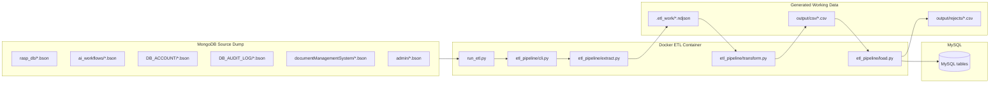
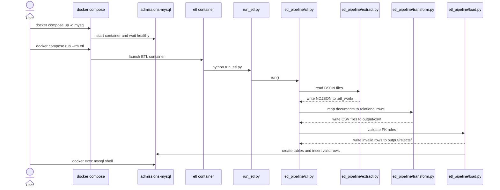
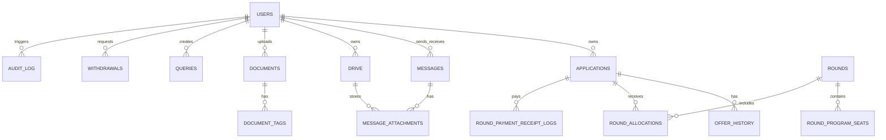

# Migration Flow and Architecture

## Architecture Overview

## End-to-End Flow

## Table Relationship View

## Notes

- The source folders on the left are the MongoDB dump files.
- The ETL container converts them into relational rows and loads them into MySQL.
- Invalid foreign-key rows are not loaded; they are written to `output/rejects/` for review.
- The diagram reflects the current Docker-first migration setup in this repository.
